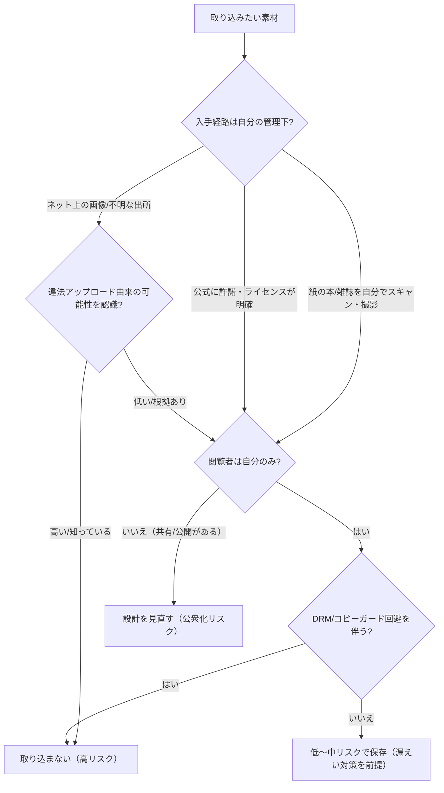

# 私的利用の蔵書ロッカー型個人開発アプリにおける著作権・肖像権リサーチ報告書

## エグゼクティブサマリ

本件ユースケース（個人開発アプリ／ログインは自分のみ／対外公開しない／複数端末で閲覧するためにデプロイする／容量制約があり画質は落としてよい）では、**「購入済みの紙の書籍・雑誌を自分でスキャン・撮影して、自己のアカウントでのみ保存・閲覧する」**という設計に寄せる限り、著作権法30条（私的使用のための複製）の射程に入りやすく、**法的リスクは相対的に低い**位置づけになります。citeturn30view1turn31view2

一方で、同じ「私的利用」でも、実務上の事故が起きやすい地雷は概ね次の三つです。  
**(a) DRM・コピーガード等の回避**（私的複製の例外から外れる）、**(b) 違法アップロード由来と知りながらのダウンロード**（同様に例外から外れる）、**(c) 公開設定ミス等による“公衆化”（第三者アクセス可能化）**です。citeturn31view2turn30view1turn29search0turn29search1

肖像権・パブリシティ権については、あなたが第三者に見せない前提であれば争点化しにくい一方、**漏えい・共有・SNS転送・公開リンク発行**など外部化が起きた瞬間に、人格権（肖像権）・パブリシティ権（著名人の顧客吸引力の排他的利用）・写真の著作権が同時に立ち上がり得ます。特にentity["musical_artist","ピンク・レディー","japanese pop duo"]事件でentity["organization","最高裁判所","japan highest court"]は、肖像等の無断使用が違法となり得る類型（商品化・差別化目的での付与・広告使用等）を示しています。citeturn31view0

したがって、結論としての「最適解」は、**法の解釈だけでなく、事故（公開・漏えい）を起こしにくいアーキテクチャに落とすこと**です。具体策は本レポート後半の「設計・実装ガイド」「リスク評価表」に落とし込みます（公開リンク禁止、ストレージのパブリックアクセス防止強制、短命トークン、暗号化バックアップ、来歴メタデータ等）。citeturn29search0turn29search1turn29search2

## 前提と結論の整理

対象法域はentity["country","日本","country"]法（著作権法、民法不法行為、判例上の人格権等）。ユーザーはあなた一人で、Google認証等で本人のみログインという想定です（ただし「外形的にインターネットに載る」ため、設定ミス時の公衆化リスクは残ります）。citeturn29search0turn29search1

扱うコンテンツは、購入済みの書籍・雑誌（主に紙媒体の想定だが電子書籍も比較）、購入済み画像（ストック等を含む）および画像・写真一般です。法的論点は、著作権の中心として「複製」「公衆送信（送信可能化を含む）」「私的複製（30条）」「違法ダウンロード」「技術的保護手段（コピーガード）」、周辺として「行為主体（だれの複製・だれの送信か）」を置きます。citeturn30view1turn31view2turn13search3

最終的な方針は次の二層です。  
第一層（法的に“そもそもアウト化しやすい”行為の排除）：DRM回避・違法ソース依拠・代行スキャンの安易な利用を避ける。citeturn31view2turn30view1  
第二層（事故による“公衆化”を構造的に起こしにくくする）：公開アクセス防止、セッション・認可堅牢化、暗号化と監査、バックアップを含む運用設計。citeturn29search1turn29search0turn29search2

## 著作権の法的論点

著作権の基本は「著作物の利用行為に対応した支分権（複製権、公衆送信権等）があり、原則は許諾が必要」という構造です。entity["organization","文化庁","japanese government agency"]の教材類も、利用行為（コピー・スキャン・HP掲載等）ごとに働く権利が異なる点を整理しています。citeturn16search2turn13search14

### 複製と公衆送信の“どこが問題になるか”

蔵書ロッカー型アプリで典型的に発生する行為は、(1) 書籍や雑誌ページのスキャン・撮影→保存、(2) 画像の保存、(3) サーバに置いたデータを端末に表示（配信）です。ここで(1)(2)は基本的に「複製」に該当します（印刷・写真・複写などによる有形的再製という理解）。citeturn13search17turn16search2

(3) は「公衆送信」になり得ますが、著作権法上の公衆送信は“公衆”向けであることが要で、一般に「不特定又は多数」に向けた性質が問題になります。あなた一人だけがアクセスできるなら、ここは外れやすいものの、「公開URL」「弱い認証」「誤ったバケット公開」などで第三者がアクセス可能になると、送信可能化を含む公衆送信のリスクが急上昇します。citeturn13search3turn29search0turn29search1

### 私的使用のための複製の射程と限界

著作権法30条は、家庭内など限られた範囲で、仕事以外の目的で、本人が複製する場合に例外を認める趣旨が説明されています。citeturn30view1turn31view2  
entity["organization","著作権情報センター","copyright info center japan"]も、私的複製は「自分自身や家族、ごく親しい少人数の友人など限られた範囲内」を前提にしつつ、例外（コピーガード回避・違法配信と知りながらのダウンロード等）を整理しています。citeturn16search10

特にあなたの想定で要注意なのは、次の除外領域です。  
- **コピーガード等（技術的保護手段）の回避により可能となった複製を、知りながら行う**場合：30条の適用から外れる趣旨が明記されています。citeturn31view2turn30view1  
- **著作権侵害の自動公衆送信（違法アップロード）だと知りながらのダウンロード**：音楽・映像に加え、漫画・書籍等も対象に含める説明が教材に含まれています（一定の軽微利用の例外に触れつつ“対象外”と整理）。citeturn30view1turn31view2turn1search10

したがって、あなたが「本物志向のビジュアル」を追求するほど、**“どこから持ってきたか”の来歴**が実務上の判断軸になります。紙の現物から自分でスキャンするのはこの点で強い一方、ネット上の高画質画像を寄せ集めると、来歴が弱くなりがちです。citeturn30view1turn1search10

### 代行スキャンと行為主体

私的複製は“本人が複製する”という要件が説明されており、教材では「使用者の手足として他者に複製作業を頼むこと」に触れています。citeturn30view1  
しかし、外部業者が独立事業として大量にスキャンし、ユーザーは書籍を送って結果を受け取るだけ、という態様は、裁判例で業者側の複製主体性が問題になり、差止が認められた事案（いわゆる自炊代行）が形成されています。citeturn22search0turn18search1

この含意は実務的に明快で、あなたのアプリが安全圏にいるための条件の一つは「**入力（スキャン）工程を自分の手元に保持する**」ことです（家族の補助はまだしも、“業者に丸投げして納品”は危険側）。citeturn22search0turn30view1

### クラウド配備と“送信主体”の問題

あなたのケースは“自分のためのアプリ”なので、放送再送信のような典型事案とは距離がありますが、クラウドに載せる以上、「誰が送信主体か」「誰が複製主体か」という審査軸は理解しておく価値があります。

entity["organization","知的財産高等裁判所","ip high court japan"]や最高裁の判断枠組みの流れとして、事業者が機器やシステムを管理し、対価を得て、利用者を広く募集するような構造では、サービス提供者側の行為主体性（送信・複製の主体）が争点化し得ます（「まねきTV」「ロクラクⅡ」等の遠隔視聴・録画サービスをめぐる系譜）。citeturn30view3turn28search4turn28search2

あなたのアプリが“サービス化”しない限り、同種の帰結には触れにくいものの、**「自分以外が使える」構造（複数ユーザー、招待制、共有リンク、家族プラン）を追加すると、評価の地平が変わる**点は設計上の分水嶺です。citeturn30view1turn13search3

## 肖像権・パブリシティ権の論点

### 肖像権とプライバシーの実務像

肖像権は、一般に人格権（憲法13条の人格的利益等）を根拠に、無断撮影・無断公表が問題になり得ます。entity["organization","個人情報保護委員会","japan ppc"]の資料でも、承諾なく撮影した写真をサイトに掲載する行為が肖像権侵害と認められた裁判例の要旨が整理されています。citeturn14search1

あなたのユースケースは「本人だけ閲覧」で外部公表がないため、通常は紛争化しにくいですが、**漏えい（第三者閲覧）＝実質的な公表**になり得るため、技術対策がそのまま法的リスク低減策になります。citeturn29search1turn29search2

### パブリシティ権の境界

パブリシティ権は、著名人の氏名・肖像等が持つ顧客吸引力を排他的に利用する利益として論じられ、最高裁は、無断使用が違法となり得る典型を「商品としての使用」「商品差別化のための付与」「広告としての使用」等として整理しています。citeturn31view0

あなたが「本物志向のビジュアル」で芸能人写真などをUIの“キービジュアル”や“アイコン”に使うと、たとえ対外公開していなくても、設計思想としては「顧客吸引力の利用」に寄った構造になり得ます。実務的にはやはり外部化しない限り問題化しにくい一方、漏えい時のダメージが大きくなるため、**素材の選び方（自分が撮影したもの、許諾・フリー利用の明確なもの、または“本の表紙を自分で撮る”）**が安全です。citeturn31view0turn30view1

## 設計・実装ガイド

本節は「法律の言葉」を「事故りにくい設計」に写像します。ポイントは、**私的複製の要件（閉鎖性・本人利用）を技術で担保する**ことです。citeturn31view2turn30view1

image_group{"layout":"carousel","aspect_ratio":"16:9","query":["personal digital library app bookshelf UI","self-hosted photo library web app UI","document scanner archive app UI"],"num_per_query":1}

### 保存単位とメタデータ設計

最小限でも、次の二階層が堅いです。

- **論理単位（作品・号）**：ISBN/雑誌号数、購入形態（紙/電子/画像パック）、購入日、出所（自分でスキャン/撮影、公式配布等）、権利根拠（私的複製/ライセンス/フリー利用）  
- **物理単位（アセット）**：ページ画像・サムネ・OCRテキスト・表紙画像・抜粋など

“出所”を持つ理由は、違法ダウンロード領域を避けるためです（「侵害の事実を知りながら」ダウンロード等が問題になり得る）。citeturn30view1turn1search10

推奨メタ（例）：`source_type`（paper_scan / photo / licensed_download）、`source_note`（購入店・自分で撮影等）、`sha256`、`created_at`、`original_work_ref`（ISBN等）、`sensitivity`（人物写真を含む等）。  
ハッシュは重複排除・改ざん検知・漏えい調査の補助になります（“推奨”として提示）。

### 画像形式・解像度の具体推奨

目的が「蔵書ロッカー的に保存・閲覧」かつ「容量制約があり画質は落としてよい」なら、**“読める最低限”に落とし、かつ漏えい時の二次利用価値を下げる**設計が合理的です。citeturn30view1turn29search7

WebPはGoogleが開発した画像形式で、JPEG/PNGより小さくできる旨が公式ドキュメントで説明されています。citeturn29search7turn29search3  
また、AVIF/WebPなどの“新しい形式”を使うことが画像配信の軽量化に有効だという整理もあります。citeturn29search35

#### 実装パラメータ比較表（目安）

| 保存用途 | 推奨形式 | 推奨パラメータ（目安） | 容量への効き | コメント |
|---|---|---|---|---|
| サムネ（一覧） | WebP（lossy） | 長辺 320–480px / 品質 45–55 | 非常に良い | 一覧の「本物感」はここが支配的。まずサムネ品質を確保。citeturn29search7 |
| 閲覧用ページ画像 | WebP（lossy） | 長辺 1400–2000px / 品質 55–65 | 良い | 文字可読性と容量のバランス。JPEGより小さくなる傾向が示されている。citeturn29search3turn29search11 |
| 図版・線画（コマ、図表） | WebP（lossless または高品質 lossy） | 長辺 1600–2400px / 品質 70+（lossy時） | 中 | 線のにじみが気になるなら例外的に高品質化。citeturn29search3 |
| まとめ保存（冊子単位） | PDF（画像埋め込み） | 内部画像を上記に統一 | 中 | “冊子単位の持ち運び”に便利だが、漏えい時に丸ごと流通しやすい点は注意（後述の暗号化で相殺）。 |
| OCRテキスト（検索用） | UTF-8テキスト | 検索インデックスは暗号化領域へ | 容量小 | サーバに保存＝複製として整理され得るため、保護を強める。citeturn16search7 |

### 認証・認可・セッションと“公衆化防止”

あなたの前提は「自分のみログイン」なので、設計目標は“ユーザー追加”よりも**誤公開しないこと**です。

- **共有機能を作らない**：公開リンク、招待URL、匿名閲覧、検索エンジンインデックス（robots等）をそもそも持たない。  
- **通信は常時HTTPS**：セッションID交換を含め、全セッションでTLSが重要である旨が整理されています。citeturn29search2  
- **Cookie/トークンの基本対策**：ログアウト時の無効化、期限、固定化（セッション固定対策）等はentity["organization","OWASP","appsec nonprofit"]のセッション管理ガイダンスが参照になります。citeturn29search2turn29search14  

### 漏えい対策としてのストレージ設定

自己ホストでも一般クラウドでも、事故の大半は「公開設定ミス」に集約されます。ここは法令以前に、**公開アクセスの技術的遮断**が最重要です。

- entity["company","Amazon Web Services","cloud provider"]のS3では、Block Public AccessがポリシーやACLによる公開許可を上書きして公開を制限できる旨が公式ドキュメントにあります。citeturn29search0turn29search4  
- entity["company","Google","technology company"] Cloud Storageでも、公開アクセスを防止する設定（Public Access Prevention）で、匿名ユーザー等への付与を制限できる旨が公式に説明されています。citeturn29search1turn29search9  

加えて推奨される運用は、(a) バケット単位での公開防止を「強制」、(b) オブジェクトのURLを推測不能（ランダムキー）にし、(c) 署名付きURLは短命、(d) 監査ログを残す、です（いずれも実務上の定石として“推奨”）。

### バックアップ方針と“複製が増える”問題

バックアップは当然に複製を増やします。しかし、私的領域内での複製の許容という枠内に収まる限り、実務上は「保護（暗号化・アクセス制御）を前提に増やす」ことが重要です。citeturn31view2turn29search2

推奨は次の構成です。  
- オンライン（同一クラウド内）バックアップ：暗号化＋アクセス最小化（運用の容易さ優先）  
- オフライン（手元の暗号化ストレージ）バックアップ：漏えい面のリスクを下げる  
- 事故対応：鍵ローテーション、公開アクセス監査、全オブジェクト失効（署名URL停止）を即時に行える設計

### 判断フロー（Mermaid）



## リスク評価表

評価基準は「法の要件からの距離」×「事故（公開・漏えい）確率」×「漏えい時の被害（著作権＋肖像権等の複合）」です。citeturn31view2turn31view0turn29search1

| 行為 | 主な論点 | リスク | 低減策の要点 |
|---|---|---|---|
| 購入した紙書籍・雑誌を自分でスキャンして保存・閲覧（自分のみ） | 複製／私的複製30条 | 低 | 閲覧者を1人に固定、共有導線ゼロ。citeturn30view1turn31view2 |
| 紙書籍を“代行業者”に送って電子化してもらう | 複製主体／私的複製の限界 | 高 | 代行を使わず自分で実施。citeturn22search0turn18search1 |
| 電子書籍のDRMを解除して保存 | 技術的保護手段回避→30条除外 | 高 | DRM回避をしない、正規アプリのオフライン機能等へ寄せる。citeturn31view2turn30view1 |
| 違法アップロード由来と知りつつPDF/画像をDLして保存 | 違法DL→30条除外 | 高 | 出所メタデータを残し、不明なものは入れない。citeturn30view1turn1search10 |
| 購入誌面の一部をスクショ・切り抜きして保存（自分のみ） | 複製／私的領域 | 低 | 低解像度化＋暗号化。citeturn31view2turn29search2 |
| 公式サイトの宣材写真・表紙画像をDLしてカバーに使用 | 複製（許諾不明） | 中 | 代替：現物表紙を自分で撮影、またはライセンス明確な素材に限定。citeturn30view1turn31view2 |
| 人物写真（一般人）を保存（自分だけ閲覧） | 肖像権は表面化しにくいが漏えい時に問題化 | 中 | 公開アクセス防止・端末ロック・暗号化・監査。citeturn14search1turn29search1turn29search2 |
| 著名人写真をUIの主要要素として保存・表示 | パブリシティ権（外部化時に特に） | 中 | “自分撮影” or 許諾素材へ、漏えい対策を厚く。citeturn31view0turn29search1turn29search2 |
| “共有リンク”で閲覧可能にする（パスワード付きでも） | 公衆送信（送信可能化）に接近 | 高 | 共有機能を作らない。どうしてもなら家族限定＋技術的に厳格化。citeturn13search3turn31view2 |
| オブジェクトストレージのバケットを誤って公開 | 公衆送信・大量侵害 | 高 | 公開アクセス防止を強制（S3/GCS）。citeturn29search0turn29search1 |

## 対外説明用要約とFAQ

### 対外説明用要約

本アプリは、利用者本人のみがログインして、本人が購入した書籍・雑誌等を本人の私的利用の範囲で保存・閲覧することを目的とする。著作物のスキャンや保存は「複製」に当たり得るが、家庭内等の限られた範囲で本人が利用するために行う複製は、著作権法30条（私的使用のための複製）の考え方に沿って運用する。運用上は、(1) 共有機能を設けない、(2) 公開アクセスを技術的に遮断する、(3) コピーガード回避や違法ソース由来のダウンロードを行わない、(4) 取り込み素材の来歴メタデータを保存する、(5) 暗号化・監査ログ等で漏えいを防止する、という方針を採用する。citeturn31view2turn30view1turn29search1turn29search2

### FAQ

**Q：クラウドに置いて複数端末で閲覧するのは「公衆送信」になりますか？**  
A：閲覧者があなた一人に限定され、第三者がアクセスできない構造なら、公衆（不特定または多数）への送信という問題設定から外れやすいです。ただし公開設定ミスで第三者が見られる状態になると、送信可能化を含む公衆送信リスクが跳ね上がるので、公開アクセス防止を強制してください。citeturn13search3turn29search1turn29search0

**Q：紙の本を全部スキャンして保存しても大丈夫ですか？**  
A：「私的使用のための複製」の趣旨説明では、家庭内等の限られた範囲で本人が使う例外として整理されています。前提（本人利用・閉鎖性・違法ダウンロード等の除外）から外れない設計が重要です。citeturn30view1turn31view2

**Q：スキャンを外注（代行）すると何がまずいですか？**  
A：代行業者が独立事業としてスキャンし納品する態様では、業者側が複製主体と評価され、私的複製の抗弁が通らず差止が認められた裁判例の蓄積があります。自分でスキャンする設計を推奨します。citeturn22search0turn18search1

**Q：電子書籍（DRM付き）を変換して入れたいです。**  
A：コピーガード等の技術的保護手段を回避して複製する行為は、私的複製の対象外となる整理がされています。DRM回避は避け、正規アプリの範囲での利用に寄せるのが安全です。citeturn31view2turn30view1

**Q：雑誌の芸能人写真を保存する場合、パブリシティ権が問題ですか？**  
A：本人だけが閲覧する限りは争点化しにくいですが、漏えい・公開・広告的利用の局面では、最高裁が示した類型に照らしパブリシティ権侵害が問題になり得ます。公開アクセス遮断と、素材の来歴管理が重要です。citeturn31view0turn29search1turn29search2

**Q：安全側に倒すために、アプリ側でできる“最小セット”は？**  
A：(1) 共有機能なし、(2) 常時HTTPS、(3) セッション無効化・短期限、(4) ストレージ公開防止を強制、(5) 暗号化バックアップ、の5点です。ガイダンスとしてOWASPやクラウド公式設定が参照になります。citeturn29search2turn29search0turn29search1

## 参考文献

```text
e-Gov法令検索（著作権法：最新条文の参照元）
https://laws.e-gov.go.jp/law/345AC0000000048

文化庁「著作権テキスト」（私的複製の整理を含む）
https://www.bunka.go.jp/seisaku/chosakuken/textbook/pdf/94081601_01.pdf

文化庁資料「私的使用目的の複製に係る権利制限について」
https://www.bunka.go.jp/seisaku/bunkashingikai/chosakuken/hoki/h30_06/pdf/r1411529_06.pdf

文化庁「違法ダウンロードの対象拡大等」（解説ページ）
https://www.bunka.go.jp/seisaku/chosakuken/hokaisei/kaisei/r01_hokaisei/illegal_download.html

最高裁（ピンク・レディー事件：肖像・パブリシティ権）
https://www.courts.go.jp/assets/hanrei/hanrei-pdf-81957.pdf

最高裁（ロクラクⅡ事件：複製主体等が争点化した系譜の一例）
https://www.courts.go.jp/assets/hanrei/hanrei-pdf-81015.pdf

個人情報保護委員会「肖像権・プライバシーに関する裁判例」
https://www.ppc.go.jp/files/pdf/20220309_shiryou-3.pdf

AWSドキュメント：S3 Block Public Access
https://docs.aws.amazon.com/AmazonS3/latest/userguide/access-control-block-public-access.html

Google Cloudドキュメント：Cloud Storage 公開アクセス防止
https://docs.cloud.google.com/storage/docs/public-access-prevention?hl=ja

OWASP Session Management Cheat Sheet
https://cheatsheetseries.owasp.org/cheatsheets/Session_Management_Cheat_Sheet.html

Google Developers：WebP（圧縮・特性）
https://developers.google.com/speed/webp
https://developers.google.com/speed/webp/docs/compression

Chrome Developers：画像配信の改善（AVIF/WebP等）
https://developer.chrome.com/docs/performance/insights/image-delivery

Japanese Law Translation（Copyright Act：英訳、条文構造確認）
https://www.japaneselawtranslation.go.jp/en/laws/view/3379/en
```