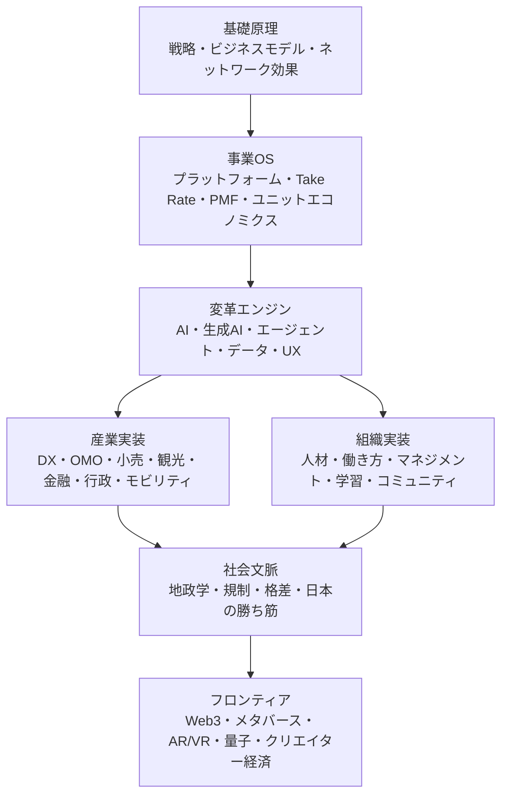

# 尾原コミュニティ動画・メディア 深掘り地図

作成日: 2026-07-08  
元資料: `参考資料/ITビジネスの原理　実践編　講義まとめ.xlsx`

## 0. この地図の読み方

この一覧は、単なる動画リストではなく「ITビジネスの原理」がどのテーマへ展開されてきたかの履歴として読むと価値が高い。

元データは大きく2系統ある。

| 系統 | 件数 | 主な意味 |
|---|---:|---|
| 講義・対談まとめ | 578件 | コミュニティ内で継続的に深掘りされた主教材 |
| 尾原メディアまとめ | 351件 | 外部向けに時流化・一般化された解説、記事、登壇 |
| 合計 | 929件 | 2018-2026年のテーマ変遷を俯瞰できる母集団 |

分類はタイトルからの仮分類なので、厳密なタグではなく「深掘りの入口」として使う。

## 1. 全体地図

尾原氏のコンテンツは、次の5層で見ると整理しやすい。



深掘りは、最新テーマから入るよりも「基礎原理 → AIによる再定義 → 産業・組織への実装」の順に進めるのがよい。生成AIだけを追うと、なぜそれが事業優位や組織変革になるのかが薄くなる。

## 2. テーマ別の厚み

タイトルベースの仮分類では、厚みは次の順だった。

| テーマ | 件数 | 読み方 |
|---|---:|---|
| 戦略・競争・経営理論 | 193 | 全体の背骨。どの時代テーマもここへ戻ってくる |
| AI・生成AI・エージェント | 160 | 2023年以降の主戦場。2026年はAIエージェントが中心 |
| 社会・政策・地政学 | 133 | 技術を社会制度・国家戦略で読む層 |
| Web3・メタバース・クリエイター | 105 | 2021-2022年に厚い。現在はAI/AR/クリエイター文脈へ再接続 |
| 組織・人材・働き方 | 91 | AI時代の実装力を支えるテーマ |
| DX・産業変革・OMO | 80 | 産業別に「原理がどう使われるか」を見る層 |
| プラットフォーム・ネットワーク効果 | 78 | 初期講義の重要基礎。AI時代にも再利用できる |
| 学習・教育・思考法 | 71 | 自分の学習OSを作るための補助線 |
| ビジネスモデル・収益設計 | 32 | Take Rate、ユニットエコノミクス、SaaSなどの収益構造 |
| 生活者・価値観・ウェルビーイング | 27 | キャリア・幸福・コミュニティの意味付け |

時系列では、2018-2021年は戦略・プラットフォーム・DX、2022年はWeb3/メタバース、2023年以降は生成AI、2026年はAIエージェントとAI時代の経営に重心が移っている。

## 3. 深掘り優先順位

### Priority 1: AIエージェント時代の事業再定義

今いちばん深掘りすべき中核。生成AIの使い方ではなく、「AIが経営・SaaS・マーケティング・業務設計の前提をどう変えるか」を見る。

入口になるタイトル:

| No | 日付 | タイトル |
|---|---|---|
| K-162 | 2024-08-20 | 生成AIコモディティ化の競争戦略：マルチエージェント、カスタムモデル、ドメイン |
| K-207 | 2026-05-04 | AIエージェントが経営の前提に! SaaS生き残り戦略は？ |
| K-212 | 2026-07-05 | AIエージェント時代にビジネスを再定義する「5つのパラダイムシフト」 |
| T-331 | 2025-09-13 | エージェントAIが変革するマーケティング |
| T-334 | 2025-10-15 | 生成AI「戦力化」の教科書 |

深掘り問い:

- AIエージェントは「人の代替」ではなく、どの業務ループを再設計するのか。
- SaaSは機能課金から、成果・プロセス・データ資産のどこへ課金軸を移すのか。
- 汎用AIがコモディティ化したとき、ドメイン知識・業務データ・ワークフロー統合のどれが堀になるのか。
- マーケティング、営業、リサーチ、開発で「AIが回すループ」と「人が握る判断」はどう分かれるのか。

Research Hubでの記事化タグ案:

`AIエージェント`, `生成AI戦略`, `SaaS再定義`, `業務OS`, `AIマーケティング`

### Priority 2: 戦略・ビジネスモデルの基礎原理

AI時代の変化を読むための土台。初期講義に集中しており、ここを飛ばすと最新回の意味が浅くなる。

入口になるタイトル:

| No | 日付 | タイトル |
|---|---|---|
| K-1 | 2018-03-18 | 戦略とビジネスモデル |
| K-2 | 2018-04-01 | ネットワークエフェクト ネット最強 仕組みで勝ち続ける戦略 |
| K-3 | 2018-04-09 | 儲けの秘密 Take Rate |
| K-4 | 2018-04-22 | Take Rate実践編 |
| K-17 | 2018-11-04 | ユニットエコノミクス |
| K-20 | 2018-12-17 | PMF：勝ち続けるプロダクト設計プロセス |

深掘り問い:

- ネットワーク効果、Take Rate、PMF、ユニットエコノミクスはどの順に事業の強さを作るのか。
- AIエージェント時代に「ネットワーク効果」はユーザー間だけでなく、データ、ワークフロー、モデル改善にも発生するのか。
- 収益設計は取引課金、利用課金、成果課金、データ課金のどれへ移るのか。

Research Hubでの記事化タグ案:

`戦略原理`, `ビジネスモデル`, `ネットワーク効果`, `Take Rate`, `PMF`, `ユニットエコノミクス`

### Priority 3: DX・OMO・産業変革

尾原氏の強みは、抽象原理を小売、観光、金融、行政、モビリティなどの実産業へ接続するところにある。自分の研究テーマへ応用するなら、この層を厚くしたい。

入口になるタイトル:

| No | 日付 | タイトル |
|---|---|---|
| K-15 | 2018-10-08 | OMO時代の顧客体験価値、カスタマージャーニー |
| K-25 | 2019-03-04 | アフターデジタルOMO時代のデザイン思考 |
| K-46 | 2020-02-03 | シンDX：死ぬ前に変わるために日本企業に必要なこと |
| T-79 | 2020-06-09 | 東芝CDO島田太郎さん「DXを呼び起こすネットワークの作り方」 |
| T-358 | 2026-05-28 | LINE次の進化！リアル店舗OMO遂に！ |

深掘り問い:

- DXは「IT導入」ではなく、顧客接点・業務プロセス・意思決定のどれを変える話なのか。
- OMOはリアル店舗をどうデータ化し、どこで顧客体験の差別化を作るのか。
- 業界ごとのDXは、共通パターンと固有制約にどう分解できるのか。

Research Hubでの記事化タグ案:

`DX`, `OMO`, `アフターデジタル`, `顧客体験`, `産業変革`, `LINE`

### Priority 4: 組織・人材・学習OS

AIやDXは、組織の学習速度が低いと実装できない。この層は「自分がどう学び、どうチームや仕事を変えるか」に直結する。

入口になるタイトル:

| No | 日付 | タイトル |
|---|---|---|
| K-29 | 2019-05-06 | HRTECH 個人のキャリア・企業の人財戦略の再構築 |
| K-40 | 2019-10-08 | 自走する組織：テクノロジー時代の経営システム |
| K-72 | 2021-03-08 | DX活躍人財として成長するには？ |
| K-73 | 2021-03-22 | システムシンキングをDXに |
| K-75 | 2021-04-06 | DX、前提から変わる時代に必要なクリティカルシンキング、問い続ける力 |
| T-360 | 2026-06-17 | ＠コスメ右腕 菅原さん「組織の裏側」とAI時代に向けた次なる一手 |

深掘り問い:

- AI時代に必要な能力は、プロンプト技術ではなく「問い」「業務分解」「検証」のどこにあるのか。
- 自走する組織は、KPI、権限、学習、コミュニティをどう設計しているのか。
- 個人のキャリアは、WHATの専門性からWHOとしての信頼・ネットワークへどう移るのか。

Research Hubでの記事化タグ案:

`学習OS`, `組織変革`, `AI人材`, `システム思考`, `問い`, `キャリア`

### Priority 5: 社会・地政学・日本の勝ち筋

AIやWeb3を単なる技術トレンドとしてではなく、国・制度・社会構造の変化として読むための層。Research Hubの「広い視野」を作るのに効く。

入口になるタイトル:

| No | 日付 | タイトル |
|---|---|---|
| K-10 | 2018-07-22 | ブロックチェーン 技術はもはや地政学として理解しないと見誤る |
| K-19 | 2018-12-03 | GAFAMN詳説 - なぜ世界を征せたか？GDFAMNとGDPRと私 |
| K-57 | 2020-07-20 | DX、量子、Bio、信用スコアAI、5Gは基礎、応用乱舞する次の事業の型 |
| T-356 | 2026-05-13 | 塩野誠さん「AI加速の地経学」 |
| T-359 | 2026-06-15 | 北川拓也さん「量子がAIとカケザンで加速する未来」 |

深掘り問い:

- AI覇権はモデル性能だけでなく、半導体、電力、データ、規制、教育にどう依存するのか。
- 日本の勝ち筋は、汎用プラットフォームではなく、現場・コンテンツ・産業データ・信頼設計のどこにあるのか。
- 量子、Bio、AR、AIはどこで接続し、事業機会になるのか。

Research Hubでの記事化タグ案:

`地政学`, `AI覇権`, `日本の勝ち筋`, `量子`, `規制`, `GAFAM`

## 4. 後回しでよいが、捨てない領域

### Web3・メタバース・クリエイター経済

2021-2022年に非常に厚い。現在の最優先ではないが、AI、AR、コミュニティ、クリエイター経済へ再接続すると価値が戻る。

読む観点:

- Web3を「投機」ではなく、所有・参加・コミュニティ設計として読む。
- メタバースを「3D空間」ではなく、アイデンティティ、身体性、共創、ライブ体験として読む。
- 生成AI時代のクリエイター経済と接続する。

入口:

| No | 日付 | タイトル |
|---|---|---|
| K-91 | 2021-12-05 | Web3.0解説：Blockchain, Dao, DeFi 次のインターネット解説 |
| K-101 | 2022-05-10 | コミュニティ：事業、ブランド、集客、チームを変革する力 |
| K-114 | 2022-11-07 | シン・ネットワークエフェクト |
| T-183 | 2022-02-08 | ライブゲームの未来：メタバースWeb3時代に大事な原理 |

## 5. おすすめの学習ルート

### Route A: 最短で現在のAI事業論へ行く

1. K-1 戦略とビジネスモデル
2. K-2 ネットワークエフェクト
3. K-3/K-4 Take Rate
4. K-20 PMF
5. K-123 ChatGPT/生成系AI
6. K-162 生成AIコモディティ化の競争戦略
7. K-207 AIエージェントが経営の前提に
8. K-212 AIエージェント時代の5つのパラダイムシフト

目的: 生成AIを「便利ツール」ではなく「事業構造を変えるもの」として読む。

### Route B: DX/OMOから実産業の変化を見る

1. K-15 OMO時代の顧客体験価値
2. K-25 アフターデジタルOMO時代のデザイン思考
3. K-46 シンDX
4. T-79 DXを呼び起こすネットワークの作り方
5. T-358 LINEリアル店舗OMO

目的: 抽象原理を、店舗・顧客体験・現場オペレーションへ落とす。

### Route C: 自分の学習・仕事OSを作る

1. K-21 予測する力速習
2. K-22 地頭講座
3. K-30 学びの科学
4. K-73 システムシンキングをDXに
5. K-75 クリティカルシンキング、問い続ける力
6. T-360 組織の裏側とAI時代の次なる一手

目的: 情報収集ではなく、問いを立て、構造化し、実装へ移す力を作る。

### Route D: 社会・地政学まで広げる

1. K-10 ブロックチェーンと地政学
2. K-19 GAFAMNとGDPR
3. K-57 DX、量子、Bio、信用スコアAI、5G
4. T-356 AI加速の地経学
5. T-359 量子がAIとカケザンで加速する未来

目的: 技術トレンドを、国家・制度・産業基盤の変化として読む。

## 6. Research Hubに取り込むなら

この地図をResearch Hubの収集・深掘りに接続するなら、以下のようにタグ体系を作ると扱いやすい。

| L1 | L2タグ例 | 用途 |
|---|---|---|
| 原理 | 戦略原理、ネットワーク効果、Take Rate、PMF、ユニットエコノミクス | 基礎講義の整理 |
| AI事業 | 生成AI戦略、AIエージェント、AIマーケティング、SaaS再定義 | 2023年以降の主軸 |
| 産業実装 | DX、OMO、顧客体験、産業変革、LINE、観光、小売 | 事例研究 |
| 組織実装 | AI人材、学習OS、組織変革、問い、システム思考 | 自分の仕事への接続 |
| 社会文脈 | 地政学、規制、日本の勝ち筋、GAFAM、量子 | マクロ視点 |
| フロンティア | Web3、メタバース、AR/VR、クリエイター経済、コミュニティ | 後追い再評価 |

記事化するときのテンプレ:

```text
テーマ:
対象タイトル:
なぜ今読むか:
尾原氏の原理:
現代の更新点:
事例:
自分の研究・仕事への接続:
次に読むべき関連回:
```

## 7. まず深掘りすべき10本

最初の10本は、基礎原理と現在のAIエージェントを橋渡しできるものに絞る。

| 順 | No | タイトル | 目的 |
|---:|---|---|---|
| 1 | K-1 | 戦略とビジネスモデル | 全体の言語をそろえる |
| 2 | K-2 | ネットワークエフェクト | プラットフォーム原理を押さえる |
| 3 | K-3/K-4 | Take Rate | 収益構造を見る |
| 4 | K-17 | ユニットエコノミクス | 成長の数理を見る |
| 5 | K-20 | PMF | プロダクト設計の基礎 |
| 6 | K-46 | シンDX | 日本企業の変革文脈 |
| 7 | K-73 | システムシンキングをDXに | 複雑系を見る思考法 |
| 8 | K-123 | ChatGPT/生成系AI | 生成AIブーム初期の整理 |
| 9 | K-162 | 生成AIコモディティ化の競争戦略 | AI時代の堀を考える |
| 10 | K-212 | AIエージェント時代の5つのパラダイムシフト | 2026年時点の最重要アップデート |

## 8. 自分向けの結論

この資料から見る限り、いま深掘りすべき中心は「AIエージェント」単体ではなく、次の接続である。

```text
戦略原理
  -> ネットワーク効果 / Take Rate / PMF
  -> 生成AI・エージェントによる業務ループ再設計
  -> DX/OMOでの産業実装
  -> 組織・学習OSへの落とし込み
  -> 地政学・社会制度による制約と勝ち筋
```

最初の研究テーマとしては、次の3本がよい。

1. AIエージェント時代のSaaS生き残り戦略
2. ネットワーク効果はAI時代にどう再定義されるか
3. OMO/DXの現場データはAIエージェントの堀になるか

この3本を深掘りすると、尾原氏の初期原理と最新AI文脈がつながり、Research Hubの今後の収集テーマとしても育てやすい。
